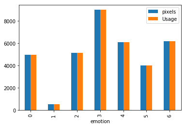
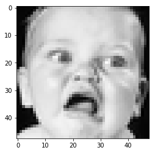
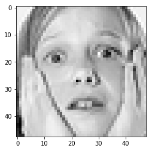
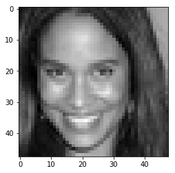
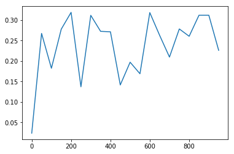
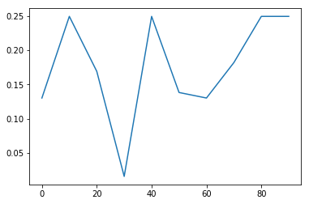
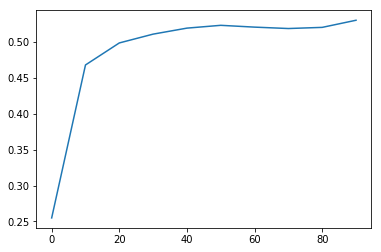
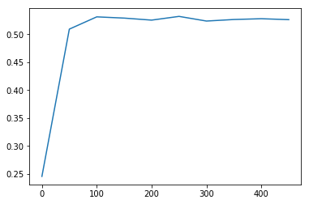

```python
import pandas as pd
import numpy as np
import random

from sklearn.utils import shuffle
import tensorflow as tf
from helpers import one_hot_encode, get_batch, get_training_set, get_test_set, log
from params import HyperParameter
```


```python
import matplotlib.pyplot as plt
%matplotlib inline
```


```python
%load_ext autoreload
%autoreload 2
```


```python
file = r'data/fer2013.csv'
df = pd.read_csv(file)

g1 = df.groupby( [ "emotion"] ).count()
g1.head(10)

```


<div>
<style>
    .dataframe thead tr:only-child th {
        text-align: right;
    }

    .dataframe thead th {
        text-align: left;
    }

    .dataframe tbody tr th {
        vertical-align: top;
    }
</style>
<table border="1" class="dataframe">
  <thead>
    <tr style="text-align: right;">
      <th></th>
      <th>pixels</th>
      <th>Usage</th>
    </tr>
    <tr>
      <th>emotion</th>
      <th></th>
      <th></th>
    </tr>
  </thead>
  <tbody>
    <tr>
      <th>0</th>
      <td>4953</td>
      <td>4953</td>
    </tr>
    <tr>
      <th>1</th>
      <td>547</td>
      <td>547</td>
    </tr>
    <tr>
      <th>2</th>
      <td>5121</td>
      <td>5121</td>
    </tr>
    <tr>
      <th>3</th>
      <td>8989</td>
      <td>8989</td>
    </tr>
    <tr>
      <th>4</th>
      <td>6077</td>
      <td>6077</td>
    </tr>
    <tr>
      <th>5</th>
      <td>4002</td>
      <td>4002</td>
    </tr>
    <tr>
      <th>6</th>
      <td>6198</td>
      <td>6198</td>
    </tr>
  </tbody>
</table>
</div>


```python
my_plot = g1.plot(kind='bar')
```





## Data

### Training


```python
df.loc[df['Usage'] == 'Training'].head(5)
```


<div>
<style>
    .dataframe thead tr:only-child th {
        text-align: right;
    }

    .dataframe thead th {
        text-align: left;
    }

    .dataframe tbody tr th {
        vertical-align: top;
    }
</style>
<table border="1" class="dataframe">
  <thead>
    <tr style="text-align: right;">
      <th></th>
      <th>emotion</th>
      <th>pixels</th>
      <th>Usage</th>
    </tr>
  </thead>
  <tbody>
    <tr>
      <th>0</th>
      <td>0</td>
      <td>70 80 82 72 58 58 60 63 54 58 60 48 89 115 121...</td>
      <td>Training</td>
    </tr>
    <tr>
      <th>1</th>
      <td>0</td>
      <td>151 150 147 155 148 133 111 140 170 174 182 15...</td>
      <td>Training</td>
    </tr>
    <tr>
      <th>2</th>
      <td>2</td>
      <td>231 212 156 164 174 138 161 173 182 200 106 38...</td>
      <td>Training</td>
    </tr>
    <tr>
      <th>3</th>
      <td>4</td>
      <td>24 32 36 30 32 23 19 20 30 41 21 22 32 34 21 1...</td>
      <td>Training</td>
    </tr>
    <tr>
      <th>4</th>
      <td>6</td>
      <td>4 0 0 0 0 0 0 0 0 0 0 0 3 15 23 28 48 50 58 84...</td>
      <td>Training</td>
    </tr>
  </tbody>
</table>
</div>


## Test


```python
df.loc[df['Usage'] == 'PublicTest'].head(5)
```


<div>
<style>
    .dataframe thead tr:only-child th {
        text-align: right;
    }

    .dataframe thead th {
        text-align: left;
    }

    .dataframe tbody tr th {
        vertical-align: top;
    }
</style>
<table border="1" class="dataframe">
  <thead>
    <tr style="text-align: right;">
      <th></th>
      <th>emotion</th>
      <th>pixels</th>
      <th>Usage</th>
    </tr>
  </thead>
  <tbody>
    <tr>
      <th>28709</th>
      <td>0</td>
      <td>254 254 254 254 254 249 255 160 2 58 53 70 77 ...</td>
      <td>PublicTest</td>
    </tr>
    <tr>
      <th>28710</th>
      <td>1</td>
      <td>156 184 198 202 204 207 210 212 213 214 215 21...</td>
      <td>PublicTest</td>
    </tr>
    <tr>
      <th>28711</th>
      <td>4</td>
      <td>69 118 61 60 96 121 103 87 103 88 70 90 115 12...</td>
      <td>PublicTest</td>
    </tr>
    <tr>
      <th>28712</th>
      <td>6</td>
      <td>205 203 236 157 83 158 120 116 94 86 155 180 2...</td>
      <td>PublicTest</td>
    </tr>
    <tr>
      <th>28713</th>
      <td>3</td>
      <td>87 79 74 66 74 96 77 80 80 84 83 89 102 91 84 ...</td>
      <td>PublicTest</td>
    </tr>
  </tbody>
</table>
</div>


## Initialize data


```python
train_X, train_y = get_training_set(df.loc[df['Usage'] == 'Training'])
test_X, test_y = get_test_set(df.loc[df['Usage'] == 'PublicTest'])
validate_X, validate_y = get_test_set(df.loc[df['Usage'] == 'PrivateTest'])
```

## Images


```python
plt.imshow(
    train_X[random.randint(1, train_X.shape[0])].reshape(48, 48),
    cmap='gist_gray')
```


    <matplotlib.image.AxesImage at 0x1a1f885208>





```python
plt.imshow(
    train_X[random.randint(1, train_X.shape[0])].reshape(48, 48),
    cmap='gist_gray')
```


    <matplotlib.image.AxesImage at 0x1a1fb65278>





```python
plt.imshow(
    train_X[random.randint(1, train_X.shape[0])].reshape(48, 48),
    cmap='gist_gray')
```


    <matplotlib.image.AxesImage at 0x1a1fc413c8>





```python
labels = 7
image_size = 2304
```

## Linear Classification

### Hyper parameters


```python
params = HyperParameter(
    num_batches=64,
    batch_size=32,
    epoch=1000,
    learning_rate=.5,
    hold_prob=0.5,
    epoch_to_report=50)

log(params)
```

    
    :  epoch: 1000, num_batches: 64, batch_size: 32, learning_rate: 0.5, hold_prob: (0.5,)


```python
from linear_classifier import LinearClassifer
model = LinearClassifer(params=params, labels=labels, image_size=image_size)

accuracyMap = model.run(
    train_X=train_X,
    train_y=train_y,
    test_X=test_X,
    test_y=test_y,
    validate_X=validate_X,
    validate_y=validate_y)
```

    Epoch:  0
    model accuracy:  0.023962106555700302
    Epoch:  50
    model accuracy:  0.2672053575515747
    Epoch:  100
    model accuracy:  0.18222345411777496
    Epoch:  150
    model accuracy:  0.27751463651657104
    Epoch:  200
    model accuracy:  0.31847310066223145
    Epoch:  250
    model accuracy:  0.13708554208278656
    Epoch:  300
    model accuracy:  0.31122875213623047
    Epoch:  350
    model accuracy:  0.2722206711769104
    Epoch:  400
    model accuracy:  0.27110615372657776
    Epoch:  450
    model accuracy:  0.14154361188411713
    Epoch:  500
    model accuracy:  0.19699080288410187
    Epoch:  550
    model accuracy:  0.16884925961494446
    Epoch:  600
    model accuracy:  0.3179158568382263
    Epoch:  650
    model accuracy:  0.2624686658382416
    Epoch:  700
    model accuracy:  0.2095291167497635
    Epoch:  750
    model accuracy:  0.27807188034057617
    Epoch:  800
    model accuracy:  0.2602396309375763
    Epoch:  850
    model accuracy:  0.31150737404823303
    Epoch:  900
    model accuracy:  0.31150737404823303
    Epoch:  950
    model accuracy:  0.22596824169158936
    Final accuracy:  0.26831987500190735


```python
epochs = [int(p) for p in accuracyMap.keys()]
plt.plot(epochs,list(accuracyMap.values()))

```


    [<matplotlib.lines.Line2D at 0x1a2bc0aba8>]





## CNN

### Hyper parameters

### Run 1


```python
params = HyperParameter(
    num_batches=64,
    batch_size=32,
    epoch=100,
    learning_rate=.5,
    hold_prob=1.0,
    epoch_to_report=10)

log(params)
```

    
    :  epoch: 100, num_batches: 64, batch_size: 32, learning_rate: 0.5, hold_prob: (1.0,)


```python
from cnn import CNN
model = CNN(params=params, labels=labels, image_size=image_size)

accuracyMap = model.run(
    train_X=train_X,
    train_y=train_y,
    test_X=test_X,
    test_y=test_y,
    validate_X=validate_X,
    validate_y=validate_y)
```

    Epoch:  0
    model accuracy:  0.13011981546878815
    Epoch:  10
    model accuracy:  0.24937307834625244
    Epoch:  20
    model accuracy:  0.16912789642810822
    Epoch:  30
    model accuracy:  0.015603232197463512
    Epoch:  40
    model accuracy:  0.24937307834625244
    Epoch:  50
    model accuracy:  0.1382000595331192
    Epoch:  60
    model accuracy:  0.13011981546878815
    Epoch:  70
    model accuracy:  0.1819448322057724
    Epoch:  80
    model accuracy:  0.24937307834625244
    Epoch:  90
    model accuracy:  0.24937307834625244
    Final accuracy:  0.24491502344608307


```python
epochs = [int(p) for p in accuracyMap.keys()]
plt.plot(epochs, list(accuracyMap.values()))
```


    [<matplotlib.lines.Line2D at 0x10666b550>]





### Run 2


```python
params = HyperParameter(
    num_batches=128,
    batch_size=128,
    epoch=100,
    learning_rate=.001,
    hold_prob=.5,
    epoch_to_report=10)

log(params)
```

    
    :  epoch: 100, num_batches: 128, batch_size: 128, learning_rate: 0.001, hold_prob: (0.5,)


```python
from cnn import CNN
model = CNN(params=params, labels=labels, image_size=image_size)

accuracyMap = model.run(
    train_X=train_X,
    train_y=train_y,
    test_X=test_X,
    test_y=test_y,
    validate_X=validate_X,
    validate_y=validate_y)
```

    Epoch:  0
    model accuracy:  0.25494566559791565
    Epoch:  10
    model accuracy:  0.46781831979751587
    Epoch:  20
    model accuracy:  0.4984675347805023
    Epoch:  30
    model accuracy:  0.5107272267341614
    Epoch:  40
    model accuracy:  0.5190861225128174
    Epoch:  50
    model accuracy:  0.522986888885498
    Epoch:  60
    model accuracy:  0.5204792618751526
    Epoch:  70
    model accuracy:  0.5185288190841675
    Epoch:  80
    model accuracy:  0.5201293405912941
    Epoch:  90
    model accuracy:  0.5300562395260789
    Final accuracy:  0.5224012789720129


```python
epochs = [int(p) for p in accuracyMap.keys()]
plt.plot(epochs, list(accuracyMap.values()))
```


    [<matplotlib.lines.Line2D at 0x1a213713c8>]





### Run 3


```python
params = HyperParameter(
    num_batches=25,
    batch_size=256,
    epoch=500,
    learning_rate=.001,
    hold_prob=.5,
    epoch_to_report=50)

log(params)
```

    
    :  epoch: 500, num_batches: 25, batch_size: 256, learning_rate: 0.001, hold_prob: (0.5,)


```python
from cnn import CNN
model = CNN(params=params, labels=labels, image_size=image_size)

accuracyMap = model.run(
    train_X=train_X,
    train_y=train_y,
    test_X=test_X,
    test_y=test_y,
    validate_X=validate_X,
    validate_y=validate_y)
```

    Epoch:  0
    model accuracy:  0.24519364535808563
    Epoch:  50
    model accuracy:  0.5093340873718262
    Epoch:  100
    model accuracy:  0.531345784664154
    Epoch:  150
    model accuracy:  0.5291167497634888
    Epoch:  200
    model accuracy:  0.5254945755004883
    Epoch:  250
    model accuracy:  0.5321816802024841
    Epoch:  300
    model accuracy:  0.5238227844238281
    Epoch:  350
    model accuracy:  0.5266090631484985
    Epoch:  400
    model accuracy:  0.5280022025108337
    Epoch:  450
    model accuracy:  0.5263304710388184
    Final accuracy:  0.5397046804428101


```python
epochs = [int(p) for p in accuracyMap.keys()]
plt.plot(epochs, list(accuracyMap.values()))
```


    [<matplotlib.lines.Line2D at 0x1095dbb38>]




