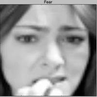
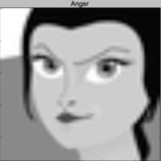
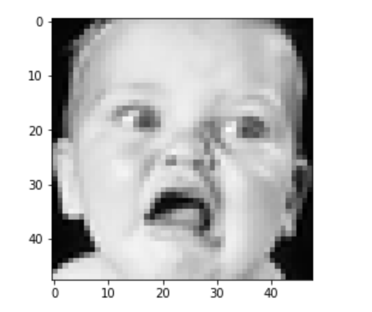
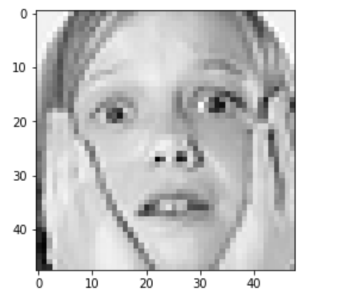
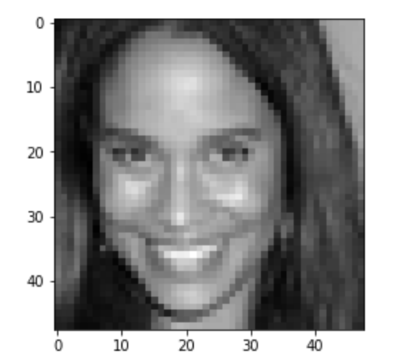
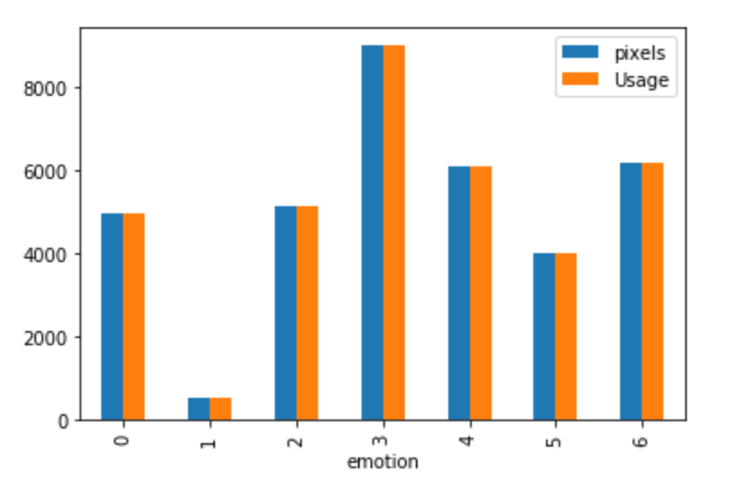
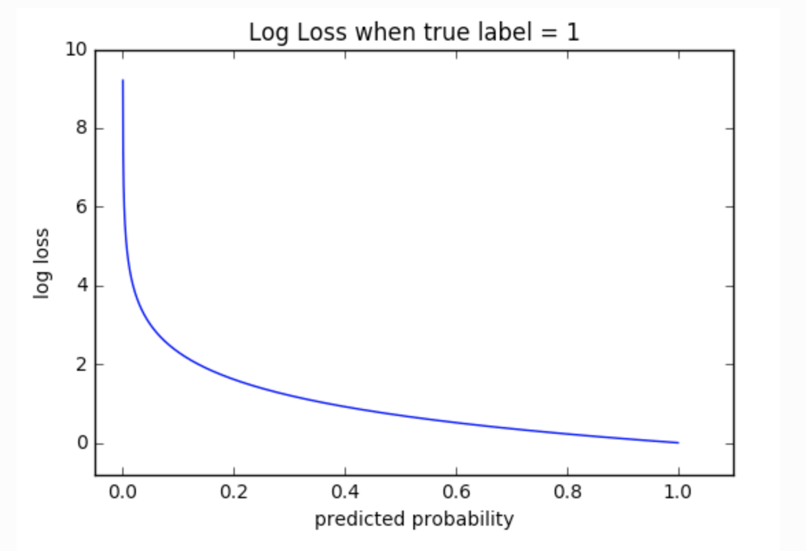
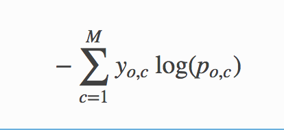
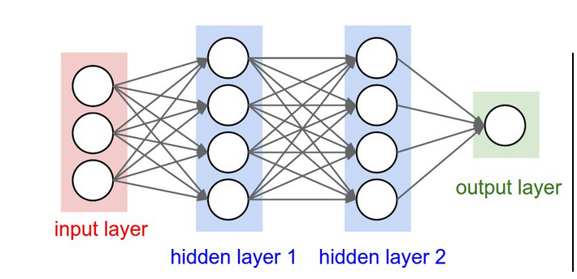

# Machine Learning Engineer Nanodegree
## Capstone Project Report
Ashwani Kumar  
May 2, 2018

## Proposal


### Domain Background
One motivation for representation learning is that learning algorithms can design features better and faster than humans can. To this end, this Kaggle problem tries to find the expression depicted by a human face. Here, the goal is to find the expression from an image not train the machine to understand the emotions. The problem can be found [here](https://www.kaggle.com/c/challenges-in-representation-learning-facial-expression-recognition-challenge).

Following are some related problems on Kaggle where the learning and solutions developed for this problem can be helpful:
1. [Facial Expression Prediction](https://www.kaggle.com/c/facial-expression-prediction4)
2. [VISUM - Facial Expression Analysis](https://www.kaggle.com/c/visum-facial-expression-analysis)
3. [Facial Expression Prediction](https://www.kaggle.com/c/csc411f15-facial-expression-prediction)


### Problem Statement
In this Kaggle problem, the challenge is to predict the likelihood that a given photo depicts one of the seven facial expressions which in turn leads to a multi-class classification machine learning problem.

The seven classes which are to identified are *Angry*, *Disgust*, *Fear*, *Happy*, *Sad*, *Surprise*, *Neutral*.

Here we need to train a CNN which will predict (after the model is trained) if a new image when given to the model belongs to one of the above-mentioned classes.

### Datasets and Inputs

The [data](https://www.kaggle.com/c/challenges-in-representation-learning-facial-expression-recognition-challenge/data) consists of 48x48 pixel grayscale images of faces. The faces have been automatically registered so that the face is more or less centered and occupies about the same amount of space in each image. The task is to categorize each face based on the emotion shown in the facial expression into one of seven categories (0=Angry, 1=Disgust, 2=Fear, 3=Happy, 4=Sad, 5=Surprise, 6=Neutral).

train.csv contains two columns, "emotion" and "pixels". The "emotion" column contains a numeric code ranging from 0 to 6, inclusive, for the emotion that is present in the image. The "pixels" column contains a string surrounded by quotes for each image. The contents of this string a space-separated pixel values in row-major order. test.csv contains only the "pixels" column and our task is to predict the emotion column.

- **The training set consists of 28,709 images.**
- **There are two test sets each containing 3589 images.**

Some sample images from the data set are:







### Visualizations and Data explorations

#### Data
##### Training

<div>
<style>
    .dataframe thead tr:only-child th {
        text-align: right;
    }

    .dataframe thead th {
        text-align: left;
    }

    .dataframe tbody tr th {
        vertical-align: top;
    }
</style>
<table border="1" class="dataframe">
  <thead>
    <tr style="text-align: right;">
      <th></th>
      <th>emotion</th>
      <th>pixels</th>
      <th>Usage</th>
    </tr>
  </thead>
  <tbody>
    <tr>
      <th>0</th>
      <td>0</td>
      <td>70 80 82 72 58 58 60 63 54 58 60 48 89 115 121...</td>
      <td>Training</td>
    </tr>
    <tr>
      <th>1</th>
      <td>0</td>
      <td>151 150 147 155 148 133 111 140 170 174 182 15...</td>
      <td>Training</td>
    </tr>
    <tr>
      <th>2</th>
      <td>2</td>
      <td>231 212 156 164 174 138 161 173 182 200 106 38...</td>
      <td>Training</td>
    </tr>
    <tr>
      <th>3</th>
      <td>4</td>
      <td>24 32 36 30 32 23 19 20 30 41 21 22 32 34 21 1...</td>
      <td>Training</td>
    </tr>
    <tr>
      <th>4</th>
      <td>6</td>
      <td>4 0 0 0 0 0 0 0 0 0 0 0 3 15 23 28 48 50 58 84...</td>
      <td>Training</td>
    </tr>
  </tbody>
</table>
</div>

#### Test
<div>
<style>
    .dataframe thead tr:only-child th {
        text-align: right;
    }

    .dataframe thead th {
        text-align: left;
    }

    .dataframe tbody tr th {
        vertical-align: top;
    }
</style>
<table border="1" class="dataframe">
  <thead>
    <tr style="text-align: right;">
      <th></th>
      <th>emotion</th>
      <th>pixels</th>
      <th>Usage</th>
    </tr>
  </thead>
  <tbody>
    <tr>
      <th>28709</th>
      <td>0</td>
      <td>254 254 254 254 254 249 255 160 2 58 53 70 77 ...</td>
      <td>PublicTest</td>
    </tr>
    <tr>
      <th>28710</th>
      <td>1</td>
      <td>156 184 198 202 204 207 210 212 213 214 215 21...</td>
      <td>PublicTest</td>
    </tr>
    <tr>
      <th>28711</th>
      <td>4</td>
      <td>69 118 61 60 96 121 103 87 103 88 70 90 115 12...</td>
      <td>PublicTest</td>
    </tr>
    <tr>
      <th>28712</th>
      <td>6</td>
      <td>205 203 236 157 83 158 120 116 94 86 155 180 2...</td>
      <td>PublicTest</td>
    </tr>
    <tr>
      <th>28713</th>
      <td>3</td>
      <td>87 79 74 66 74 96 77 80 80 84 83 89 102 91 84 ...</td>
      <td>PublicTest</td>
    </tr>
  </tbody>
</table>
</div>

## Training set grouped by classes


## Preprocessing Data
We will normalize the data so that all the pixels have 0-1 value. Also, we will add class 1 items 10 times to augment class 1 training data. As our label are 0, 1, 2, 3, 4, 5, 6, we will one-hot encode them. The complete code is availabe [here](helpers.py).
```

def one_hot_encode(x):
    """
    One hot encode a list of sample labels. Return a one-hot encoded vector for each label.
    : x: List of sample Labels
    : return: Numpy array of one-hot encoded labels
    """
    # http://scikit-learn.org/stable/modules/generated/sklearn.preprocessing.LabelBinarizer.html#sklearn.preprocessing.LabelBinarizer
    lb = LabelBinarizer()
    lb.fit(range(max(x) + 1))
    b = lb.transform(x)
    return b

# Converting space separated pixels to int array


def string_to_int_array(item):
    return [int(p) for p in item.split()]


def get_X_and_y(df):
    X = [string_to_int_array(item) for item in df.iloc[:, 1].values]
    X = np.array(X) / 255.0
    y = np.array(df.iloc[:, 0].values)
    y = np.array(one_hot_encode(y))
    y = y.astype(np.float32, copy=False)
    return X, y


def get_training_set(data):
    not_class1 = data.loc[data['emotion'] != 1]
    class1 = data.loc[data['emotion'] == 1]
    class1_aug = class1
    # This is done to handle the class imbalance for emotion 1 which has only ~500 pics
    for i in range(11):
        class1_aug = class1_aug.append(class1)
    complete_training_set = not_class1.append(class1_aug)
    return get_X_and_y(complete_training_set)
```


### Solution Statement

This is a classical image classification problem. Over the years, many successful image classification models have been developed.
Here we will be using CNN to classify the images into 7 classes. We will also use data augmentation to generate data from the existing images so that we have more data to train our model upon.


### Evaluation Metrics

We will be using Cross Entropy as the metrics to evaluate this model.
Cross-entropy loss, or log loss, measures the performance of a classification model whose output is a probability value between 0 and 1. Cross-entropy loss increases as the predicted probability diverge from the actual label. So predicting a probability of .012 when the actual observation label is 1 would be bad and result in a high loss value. A perfect model would have a log loss of 0.


The graph above shows the range of possible loss values given a true observation (isDog = 1). As the predicted probability approaches 1, log loss slowly decreases. As the predicted probability decreases, however, the log loss increases rapidly. Log loss penalizes both types of errors, but especially those predictions that are confident and wrong!

Cross-entropy and log loss are slightly different depending on context, but in machine learning when calculating error rates between 0 and 1 they resolve to the same thing.

Math

In binary classification, where the number of classes M

equals 2, cross-entropy can be calculated as:
−(ylog(p)+(1−y)log(1−p))

If M>2

(i.e. multiclass classification), we calculate a separate loss for each class label per observation and sum the result.


Here:
- M - the number of classes (anger, fear, sad etc)
- log - the natural log
- y - binary indicator (0 or 1) if class label c
- is the correct classification for observation o
- p - predicted probability observation o is of class c


### Benchmark Model

We will be solving this problem first with a linear classifier where we will use 
```
Y = Wx + B
```
and softmax cross-entropy to classify the images.


After this, we will be using a 2 hidden layer CNN to classify the images.



If the computing power supports, then more hidden layers will be added to check the performance.

And as this is a Kaggle problem, we can also compare our solution against the top Kaggle solution. If the accuracy is within **~10%** of the top solutions, we can assume that the model is performing as per the expectations.


#### Implementation

1. Data normalization: We will normalize the data so that the values are within 0-1. (See Preprocessing Data)
2. Data Augmentation: This will be done to control class imbalance as mentioned in data-input. (See Preprocessing Data)
3. The baseline will be established using a linear classifier model.

The complete code is availabe [here](linear_classifier.py).

```
 def run(self, train_X, train_y, test_X, test_y, validate_X, validate_y):
        accuracyDictionary = {};
        x = tf.placeholder(tf.float32, shape=[None, self.image_size])
        W = tf.Variable(tf.zeros([self.image_size, self.labels]))
        b = tf.Variable(tf.zeros([self.labels]))
        y = tf.matmul(x, W) + b
        y_true = tf.placeholder(tf.float32, [None, self.labels])
        cross_entropy = tf.reduce_mean(
            tf.nn.softmax_cross_entropy_with_logits_v2(labels=y_true, logits=y))
        optimizer = tf.train.GradientDescentOptimizer(
            learning_rate=self.params.learning_rate)
        train = optimizer.minimize(cross_entropy)
        init = tf.global_variables_initializer()
        correct_prediction = tf.equal(tf.argmax(y, 1), tf.argmax(y_true, 1))
        accuracy = tf.reduce_mean(tf.cast(correct_prediction, tf.float32))
        with tf.Session() as sess:
            sess.run(init)
            for step in range(self.params.epoch):
                X, y = shuffle(train_X, train_y)
                for current_batch in range(self.params.num_batches):
                    batch_X, batch_y = get_batch(
                        X, y, current_batch, self.params.batch_size)
                    sess.run(train, feed_dict={x: batch_X, y_true: batch_y})
                if step % self.params.epoch_to_report == 0:
                    log(step,"Epoch")
                    accuracyDictionary[step]=sess.run(accuracy, feed_dict={x: test_X,
                                                      y_true: test_y})
                    log(accuracyDictionary[step], "model accuracy")

            log(sess.run(accuracy, feed_dict={x: validate_X,
                                              y_true: validate_y}), "Final accuracy")
        return accuracyDictionary
```
4. CNN Layers :

   - Convolution : Convolutional layers convolve around the image to detect edges, lines, and other features.
   - MaxPooling : This layer preservs the most dominent features.
    - Dropout : In this simple we randomnly drop neuron to avoid overfitting.

```

class CNN:
    def __init__(self, params, labels, image_size):
        self.params = params
        self.labels = labels
        self.image_size = image_size

    def init_weights(self, shape):
        init_random_dist = tf.truncated_normal(shape, stddev=0.1)
        return tf.Variable(init_random_dist)

    def init_bias(self, shape):
        init_bias_vals = tf.constant(0.1, shape=shape)
        return tf.Variable(init_bias_vals)

    def conv2d(self, x, W):
        # x --> [batch,H,W,channels]
        # W --> [filter H, filter W, Channels In, Channels Out]
        return tf.nn.conv2d(x, W, strides=[1, 1, 1, 1], padding="SAME")

    def max_pool_2x2(self, x):
        # x --> [batch,H,W,channels]
        return tf.nn.max_pool(
            x, ksize=[1, 2, 2, 1], strides=[1, 2, 2, 1], padding="SAME")

    def convolutional_layer(self, input_x, shape):
        W = self.init_weights(shape)
        b = self.init_bias([shape[3]])
        return tf.nn.relu(self.conv2d(input_x, W) + b)

    def normal_full_layer(self, input_layer, size):
        input_size = int(input_layer.get_shape()[1])
        W = self.init_weights([input_size, size])
        b = self.init_bias([size])
        return tf.matmul(input_layer, W) + b

    def run(self, train_X, train_y, test_X, test_y, validate_X, validate_y):
        accuracyDictionary = {}
        x = tf.placeholder(tf.float32, shape=[None, self.image_size])
        y_true = tf.placeholder(tf.float32, shape=[None, self.labels])
        x_image = tf.reshape(x, [-1, 48, 48, 1])
        convo_1 = self.convolutional_layer(x_image, shape=[5, 5, 1, 32])
        convo_1_pooling = self.max_pool_2x2(convo_1)

        convo_2 = self.convolutional_layer(
            convo_1_pooling, shape=[5, 5, 32, 64])
        convo_2_pooling = self.max_pool_2x2(convo_2)

        # Why 12 by 12 image? Because we did 2 pooling layers, so (48/2)/2 = 12
        convo_2_flat = tf.reshape(convo_2_pooling, [-1, 12 * 12 * 64])
        full_layer_1 = tf.nn.relu(self.normal_full_layer(convo_2_flat, 1024))

        hold_prob = tf.placeholder(tf.float32, name="hold_prob")
        full_one_dropout = tf.nn.dropout(full_layer_1, keep_prob=hold_prob)

        y_pred = self.normal_full_layer(full_one_dropout, self.labels)
        cross_entropy = tf.reduce_mean(
            tf.nn.softmax_cross_entropy_with_logits_v2(labels=y_true, logits=y_pred))
        optimizer = tf.train.AdamOptimizer(
            learning_rate=self.params.learning_rate)
        train = optimizer.minimize(cross_entropy)
        init = tf.global_variables_initializer()
        correct_prediction = tf.equal(
            tf.argmax(y_pred, 1), tf.argmax(y_true, 1))
        accuracy = tf.reduce_mean(tf.cast(correct_prediction, tf.float32))
        with tf.Session() as sess:
            sess.run(init)
            for step in range(self.params.epoch):
                X, y = shuffle(train_X, train_y)
                for current_batch in range(self.params.num_batches):
                    batch_X, batch_y = get_batch(
                        X, y, current_batch, self.params.batch_size)
                    sess.run(
                        train, feed_dict={
                            x: batch_X,
                            y_true: batch_y,
                            hold_prob: self.params.hold_prob
                        })
                if step % self.params.epoch_to_report == 0:
                    log(step, "Epoch")
                    accuracyDictionary[step] = sess.run(accuracy, feed_dict={x: test_X,
                                                                             y_true: test_y, hold_prob: 1.0})
                    log(accuracyDictionary[step], "model accuracy")
            log(
                sess.run(
                    accuracy,
                    feed_dict={
                        x: validate_X,
                        y_true: validate_y,
                        hold_prob: 1.0
                    }), "Final accuracy")
        return accuracyDictionary

```
## Results
<div>
<style>
    .dataframe thead tr:only-child th {
        text-align: right;
    }

    .dataframe thead th {
        text-align: left;
    }

    .dataframe tbody tr th {
        vertical-align: top;
    }
</style>
<table border="1" class="dataframe">
  <thead>
    <tr style="text-align: right;">
      <th>SNo.</th>
      <th>Model</th>
      <th>Params</th>
      <th>Accuracy</th>
      <th>Comments</th>
      <th>Graph</th>
    </tr>
  </thead>
  <tbody>
    <tr>
      <th>1</th>
      <td>Linear Classifier</td>
      <td>epoch: 1000, num_batches: 64, batch_size: 32, learning_rate: 0.5, hold_prob: (0.5,)</td>
      <td>0.26</td>
      <td>Here, hold_prob has no role</td>
      <td><image src="images/lc.png"/></td>
    </tr>
    <tr>
      <th>2</th>
      <td>CNN with no drop out</td>
      <td>:  epoch: 100, num_batches: 64, batch_size: 32, learning_rate: 0.5, hold_prob: (1.0,)</td>
      <td>0.24</td>
      <td>As can be seen here, it is almost similar to the linear classifier.</td>
    </tr>
    <tr>
      <th>1</th>
      <td>Linear Classifier</td>
      <td>epoch: 1000, num_batches: 64, batch_size: 32, learning_rate: 0.5, hold_prob: (0.5,)</td>
      <td>0.26</td>
      <td>Here, hold_prob has no role</td>
    </tr>
    <tr>
      <th>1</th>
      <td>Linear Classifier</td>
      <td>epoch: 1000, num_batches: 64, batch_size: 32, learning_rate: 0.5, hold_prob: (0.5,)</td>
      <td>0.26</td>
      <td>Here, hold_prob has no role</td>
    </tr>
  </tbody>
</table>
</div>

### References

1. [Convolutional Neural Networks](http://cs231n.github.io/convolutional-networks/)
2. [Cross Entropy](http://ml-cheatsheet.readthedocs.io/en/latest/loss_functions.html#cross-entropy)
3. [Cross Entropy vs RMSE](https://jamesmccaffrey.wordpress.com/2013/11/05/why-you-should-use-cross-entropy-error-instead-of-classification-error-or-mean-squared-error-for-neural-network-classifier-training/)
4. [Data Augmentation](https://medium.com/ymedialabs-innovation/data-augmentation-techniques-in-cnn-using-tensorflow-371ae43d5be9)
