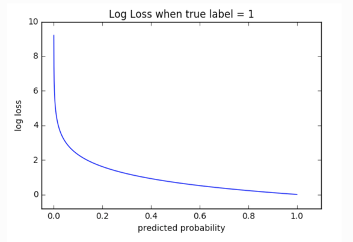

# Machine Learning Engineer Nanodegree
## Capstone Project Report
Ashwani Kumar  
May 2, 2018

## Proposal


### Domain Background
One motivation for representation learning is that learning algorithms can design features better and faster than humans can. To this end, this Kaggle problem tries to find the expression depicted by a human face. Here, the goal is to find the expression from an image not train the machine to understand the emotions. The problem can be found [here](https://www.kaggle.com/c/challenges-in-representation-learning-facial-expression-recognition-challenge).

Following are some related problems on Kaggle where the learning and solutions developed for this problem can be helpful:
1. [Facial Expression Prediction](https://www.kaggle.com/c/facial-expression-prediction4)
2. [VISUM - Facial Expression Analysis](https://www.kaggle.com/c/visum-facial-expression-analysis)
3. [Facial Expression Prediction](https://www.kaggle.com/c/csc411f15-facial-expression-prediction)


### Problem Statement
In this Kaggle problem, the challenge is to predict the likelihood that a given photo depicts one of the seven facial expressions which in turn leads to a multi-class classification machine learning problem.

The seven classes which are to identified are *Angry*, *Disgust*, *Fear*, *Happy*, *Sad*, *Surprise*, *Neutral*.

Here we need to train a CNN which will predict (after the model is trained) if a new image when given to the model belongs to one of the above-mentioned classes.

### Datasets and Inputs

The [data](https://www.kaggle.com/c/challenges-in-representation-learning-facial-expression-recognition-challenge/data) consists of 48x48 pixel grayscale images of faces. The faces have been automatically registered so that the face is more or less centered and occupies about the same amount of space in each image. The task is to categorize each face based on the emotion shown in the facial expression into one of seven categories (0=Angry, 1=Disgust, 2=Fear, 3=Happy, 4=Sad, 5=Surprise, 6=Neutral).

train.csv contains two columns, "emotion" and "pixels". The "emotion" column contains a numeric code ranging from 0 to 6, inclusive, for the emotion that is present in the image. The "pixels" column contains a string surrounded by quotes for each image. The contents of this string a space-separated pixel values in row-major order. test.csv contains only the "pixels" column and our task is to predict the emotion column.

- **The training set consists of 28,709 images.**
- **There are two test sets each containing 3589 images.**

Some sample images from the data set are:


### Visualizations and Data explorations

#### Data
##### Training

<div>
<table border="1" class="dataframe">
  <thead>
    <tr style="text-align: right;">
      <th>No.</th>
      <th>emotion</th>
      <th>pixels</th>
      <th>Usage</th>
    </tr>
  </thead>
  <tbody>
    <tr>
      <th>0</th>
      <td>0</td>
      <td>70 80 82 72 58 58 60 63 54 58 60 48 89 115 121...</td>
      <td>Training</td>
    </tr>
    <tr>
      <th>1</th>
      <td>0</td>
      <td>151 150 147 155 148 133 111 140 170 174 182 15...</td>
      <td>Training</td>
    </tr>
    <tr>
      <th>2</th>
      <td>2</td>
      <td>231 212 156 164 174 138 161 173 182 200 106 38...</td>
      <td>Training</td>
    </tr>
    <tr>
      <th>3</th>
      <td>4</td>
      <td>24 32 36 30 32 23 19 20 30 41 21 22 32 34 21 1...</td>
      <td>Training</td>
    </tr>
    <tr>
      <th>4</th>
      <td>6</td>
      <td>4 0 0 0 0 0 0 0 0 0 0 0 3 15 23 28 48 50 58 84...</td>
      <td>Training</td>
    </tr>
  </tbody>
</table>
</div>

#### Test
<div>
<table border="1" class="dataframe">
  <thead>
    <tr style="text-align: right;">
      <th>No.</th>
      <th>emotion</th>
      <th>pixels</th>
      <th>Usage</th>
    </tr>
  </thead>
  <tbody>
    <tr>
      <th>28709</th>
      <td>0</td>
      <td>254 254 254 254 254 249 255 160 2 58 53 70 77 ...</td>
      <td>PublicTest</td>
    </tr>
    <tr>
      <th>28710</th>
      <td>1</td>
      <td>156 184 198 202 204 207 210 212 213 214 215 21...</td>
      <td>PublicTest</td>
    </tr>
    <tr>
      <th>28711</th>
      <td>4</td>
      <td>69 118 61 60 96 121 103 87 103 88 70 90 115 12...</td>
      <td>PublicTest</td>
    </tr>
    <tr>
      <th>28712</th>
      <td>6</td>
      <td>205 203 236 157 83 158 120 116 94 86 155 180 2...</td>
      <td>PublicTest</td>
    </tr>
    <tr>
      <th>28713</th>
      <td>3</td>
      <td>87 79 74 66 74 96 77 80 80 84 83 89 102 91 84 ...</td>
      <td>PublicTest</td>
    </tr>
  </tbody>
</table>
</div>

## Training set grouped by classes


The above graph shows the data grouped on the basis of labels. We can see that ```label 1``` has significantly less number of records which can result in a class imbalance.
#### Class imbalance problem
It is the problem in machine learning where the total number of a class of data (positive) is far less than the total number of another class of data (negative). This problem is extremely common in practice and can be observed in various disciplines including fraud detection, anomaly detection, medical diagnosis, oil spillage detection, facial recognition, etc. 

We will handle this problem during our pre-processing of the data.

### Solution Statement

This is a classical image classification problem. Over the years, many successful image classification models have been developed.
Here we will be using CNN to classify the images into 7 classes. We will also use data augmentation to generate data from the existing images so that we have more data to train our model upon.


### Evaluation Metrics

We will be using Cross Entropy as the metrics to evaluate this model.
Cross-entropy loss, or log loss, measures the performance of a classification model whose output is a probability value between 0 and 1. Cross-entropy loss increases as the predicted probability diverge from the actual label. So predicting a probability of .012 when the actual observation label is 1 would be bad and result in a high loss value. A perfect model would have a log loss of 0.


The graph above shows the range of possible loss values given a true observation (isDog = 1). As the predicted probability approaches 1, log loss slowly decreases. As the predicted probability decreases, however, the log loss increases rapidly. Log loss penalizes both types of errors, but especially those predictions that are confident and wrong!

Cross-entropy and log loss are slightly different depending on context, but in machine learning when calculating error rates between 0 and 1 they resolve to the same thing.

Math

In binary classification, where the number of classes M

equals 2, cross-entropy can be calculated as:
−(ylog(p)+(1−y)log(1−p))

If M>2

(i.e. multiclass classification), we calculate a separate loss for each class label per observation and sum the result.


Here:
- M - the number of classes (anger, fear, sad etc)
- log - the natural log
- y - binary indicator (0 or 1) if class label c
- is the correct classification for observation o
- p - predicted probability observation o is of class c


### Benchmark Model

We will be solving this problem first with a linear classifier where we will use 
```
Y = Wx + B
```
and softmax cross-entropy to classify the images.


After this, we will be using a 2 hidden layer CNN to classify the images.


If the computing power supports, then more hidden layers will be added to check the performance.

And as this is a Kaggle problem, we can also compare our solution against the top Kaggle solution. If the accuracy is within **~10%** of the top solutions, we can assume that the model is performing as per the expectations.


### Implementation

#### Pre-processing Data
We will normalize the data so that all the pixels have 0-1 value. Also, we will add class 1 items 10 times to augment class 1 training data. As our label are 0, 1, 2, 3, 4, 5, 6, we will one-hot encode them. The complete code is available [here](https://github.com/ashwanikumar04/udacity-mlnd-capstone/blob/master/helpers.py).

As mentioned earlier, the data is not uniform. The images which belong to label 1 are very less compared to other labels. In order to handle this, we will replicate label 1 class images 10 times which will result in around ~5K images for this label thus mitigating the class imbalance.


1. Linear  classifier:

I used a linear classifier to classify the images. 
```
y = xW + b
```

Here, x is the image vector of size [?,2304]. ? denotes any number.
```W``` is the weight vector of dimension [2304,7]. 7 is for the number of classes.

```b``` is a bias vector of dimension [7].

#### Advantages of parametrized learning and linear classification

There are two primary advantages to utilizing parameterized learning, such as in the approach I detailed above:

    - Once we are done training our model, we can discard the input data and keep only the weight matrix W and the bias vector b. This substantially reduces the size of our model since we only need to store two sets of vectors (versus the entire training set).
    - Classifying new test data is fast. In order to perform a classification, all we need to do is take the dot product of W and x_{i}, followed by adding in the bias b. Doing this is substantially faster than needing to compare each testing point to every training example (as in the k-NN algorithm).


The complete code is available [here](https://github.com/ashwanikumar04/udacity-mlnd-capstone/blob/master/linear_classifier.py).


As we can see that the accuracy achieved by linear classification is very low. One big disadvantage of using linear classification for this problem is that it does not take into account the relative location of pixels to each other. 

That is why we need to look for another classification algorithm.
CNN fits our requirement.


2. Convolutional Neural Networks (CNNs):

The process of building a Convolutional Neural Network always involves four major steps.

* Step - 1: Convolution

* Step - 2: Pooling

* Step - 3: Flattening

* Step - 4: Full connection

Layers :

- Convolution: Convolutional layers convolve around the image to detect edges, lines etc. Convolutional layers hyperparameters are the number of filters, filter size, stride, padding and activation functions for introducing non-linearity.
- MaxPooling: Pooling layers reduces the dimensionality of the images by retaining the dominant pixels. Maxpooling replaces a n x n area of an image with the maximum pixel value from that area to downsample the image. Other pooling options include MeanPooling, SumPooling etc.
- Dropout: Dropout is a simple and effective technique to prevent the neural network from overfitting during the training. Dropout is implemented by shooting a neuron randomly based on a probability. This results in the neural network not rely on the redundant info.
- Flatten: Flattens the output of the convolution layers to feed into the Dense layers.
- Dense: Dense layers are the traditional fully connected networks that map the scores of the convolutional layers into the correct labels with some activation function (softmax used here)

Activation functions :

Activation layers apply a non-linear operation to the output of the other layers such as convolutional layers or dense layers.


    ReLu Activation: the ReLU is half rectified (from bottom). f(z) is zero when z is less than zero and f(z) is equal to z when z is above or equal to zero.

Optimizers :

    Adam: Adam (Adaptive moment estimation) is an update to RMSProp optimizer in which the running average of both the gradients and their magnitude is used. I used Adam in all the test runs to provide a consistent baseline.

#### Model:


### Refinement

This did not improve much in the accuracy. So I included a drop out layer.


After adding the dropout and several trials, I got a decent accuracy.


I tested with multiple variations of the hyperparameters. 
I changed epoch size, batch size, learning rate etc to test multiple times. 

After multiple tests, I got the following combination of the hyperparameters
```
epoch: 500, num_batches: 25, batch_size: 256, learning_rate: 0.001, hold_prob: 0.5
```
which resulted in an accuracy of **.54**.


The complete code is available [here](https://github.com/ashwanikumar04/udacity-mlnd-capstone/blob/master/cnn.py).

## Results

For each test, I saved the model which resulted in best accuracy after multiple runs.
The best model uses CNN with data augmentation by replicating the images for the label which is significantly low in number than the other labels. As I was training the model on my personal PC, I had to use fewer epochs to train the model.

The following table compares the models with different hyperparameter values.


<div>
<table border="1" class="dataframe">
  <thead>
    <tr style="text-align: right;">
      <th>SNo.</th>
      <th>Model</th>
      <th>Params</th>
      <th>Accuracy</th>
      <th>Comments</th>
    </tr>
  </thead>
  <tbody>
    <tr>
      <th>1</th>
      <td>Linear Classifier</td>
      <td>epoch: 1000, num_batches: 64, batch_size: 32, learning_rate: 0.5, hold_prob: (0.5,)</td>
      <td>0.26</td>
      <td>Here, hold_prob has no role</td>
    </tr>
    <tr>
      <th>2</th>
      <td>CNN with no drop out</td>
      <td>:  epoch: 100, num_batches: 64, batch_size: 32, learning_rate: 0.5, hold_prob: (1.0,)</td>
      <td>0.24</td>
      <td>As can be seen here, it is almost similar to the linear classifier.</td>
    </tr>
    <tr>
      <th>3</th>
      <td>CNN with drop out</td>
      <td>epoch: 100, num_batches: 128, batch_size: 128, learning_rate: 0.001, hold_prob: (0.5,)</td>
      <td>0.52</td>
      <td>Here, we have significant improvement</td>
    </tr>
      <tr>
      <th>4</th>
      <td>CNN with drop out</td>
      <td>:  epoch: 500, num_batches: 25, batch_size: 256, learning_rate: 0.001, hold_prob: (0.5,)</td>
      <td>0.54</td>
      <td>Here, we have significant improvement</td>
    </tr>
    <tr>
  </tbody>
</table>
</div>

As we can see that using CNN we significantly improved our model to classify the images into respective classes. We got to a final accuracy of **.54** which is among the top 20 accuracies on the [Kaggle leaderboard](https://www.kaggle.com/c/challenges-in-representation-learning-facial-expression-recognition-challenge/leaderboard).

We can include more techniques for data augmentation to generate more data and train the model on a faster machine with GPU to get a better accuracy.

I have used two sets of test data, so it can be inferred that the model does well against the unseen data.


## Conclusion

I have recorded the accuracy of each model as they were tested.


These two compares the two best model with respect to the accuracy. 

As we changed the hyperparameters, the accuracy improved but the model took a long time to converge.

As mentioned earlier, there are two test sets. The final accuracy is based on the private test set which is used by Kaggle to decide the position in the leaderboard.


 We got to a final accuracy of **.54** which is among the top 20 accuracies on the [Kaggle leaderboard](https://www.kaggle.com/c/challenges-in-representation-learning-facial-expression-recognition-challenge/leaderboard).


We can use the learning of the project in order to solve [this](http://www.cl.cam.ac.uk/research/dtg/attarchive/facedatabase.html) similar problem.

The complete working notebook is available [here](https://github.com/ashwanikumar04/udacity-mlnd-capstone/blob/master/facial-expression.ipynb).


## Reflection

Identifying the emotions by seeing an image, as it sounds is fascinating. This has many real-world applications like judging the mood of an online game player, or in a live video session.

The data as such was of high quality. However, to identify emotions we need a much bigger data set. For example, to differentiate an image which depicts sad against an image which depicts happy when in both the images the person has his/her hands covering his mouth can be quite difficult. In such cases, other traits like the eyes, facial expressions etc play a major role to correctly identify the label which in turn requires a huge data set to train upon. 

## Improvements

As image classification is a computationally intensive task, it is not possible to try all the variations of the hyperparameters.

However, there are other things too which can be done to improve the accuracy of the model.
1. We can save the images and then use data augmentation techniques like image rotation, adding noise etc
2. Increasing the number of epochs etc.


### References

1. [Convolutional Neural Networks](http://cs231n.github.io/convolutional-networks/)
2. [Cross Entropy](http://ml-cheatsheet.readthedocs.io/en/latest/loss_functions.html#cross-entropy)
3. [Cross Entropy vs RMSE](https://jamesmccaffrey.wordpress.com/2013/11/05/why-you-should-use-cross-entropy-error-instead-of-classification-error-or-mean-squared-error-for-neural-network-classifier-training/)
4. [Data Augmentation](https://medium.com/ymedialabs-innovation/data-augmentation-techniques-in-cnn-using-tensorflow-371ae43d5be9)
5. [Hyper Parameter Tuning](https://towardsdatascience.com/hyperparameter-tuning-the-random-forest-in-python-using-scikit-learn-28d2aa77dd74)
6. [Hyper parameters](https://medium.com/@jrodthoughts/knowledge-tuning-hyperparameters-in-machine-learning-algorithms-part-i-67a31b1f7c88)

