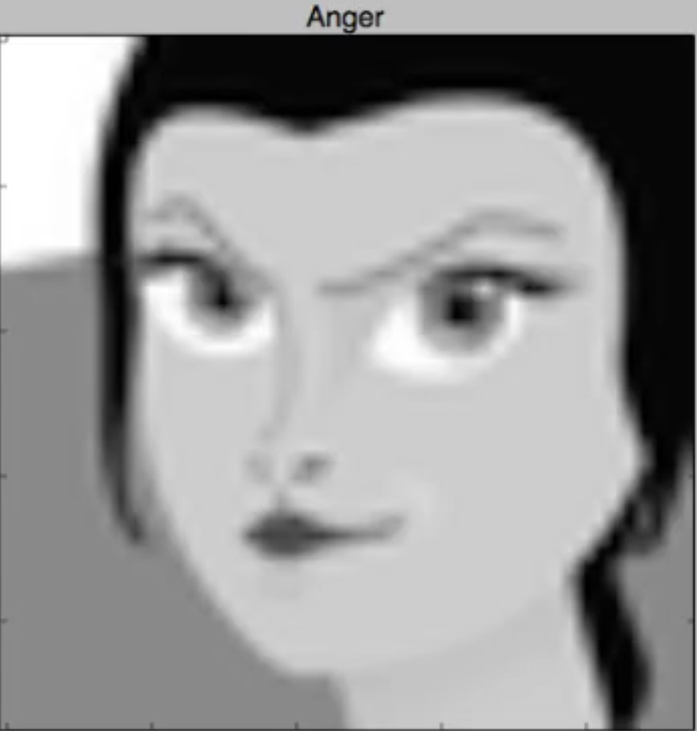
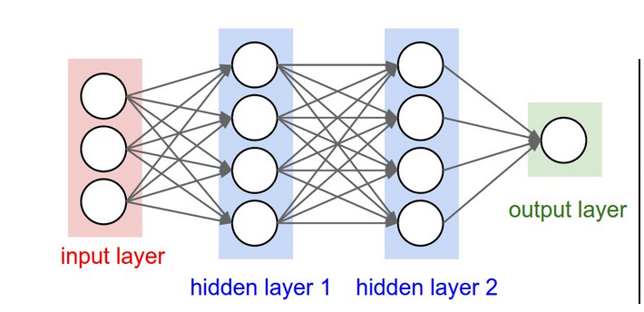

<!-- TOC -->

- [Machine Learning Engineer Nanodegree](#machine-learning-engineer-nanodegree)
    - [Capstone Proposal](#capstone-proposal)
    - [Proposal](#proposal)
        - [Domain Background](#domain-background)
        - [Problem Statement](#problem-statement)
        - [Datasets and Inputs](#datasets-and-inputs)
        - [Solution Statement](#solution-statement)
        - [Benchmark Model](#benchmark-model)
        - [Evaluation Metrics](#evaluation-metrics)
        - [Project Design](#project-design)
        - [References](#references)

<!-- /TOC -->

# Machine Learning Engineer Nanodegree
## Capstone Proposal
Ashwani Kumar  
April 8, 2018

## Proposal


### Domain Background
One motivation for representation learning is that learning algorithms can design features better and faster than humans can. To this end, this Kaggle problem tries to find the expression depicted by a human face. Here, the goal is find the expression from an image not train the machine to understand the emotions. The problem can be found [here](https://www.kaggle.com/c/challenges-in-representation-learning-facial-expression-recognition-challenge).


### Problem Statement
In this Kaggle problem, the challenge is to predict the likelihood that a given photo depicts one of the seven facial expressions which in turn leads to a multi-class classification machine learning problem.

The seven classes which are to identified are *Angry*, *Disgust*, *Fear*, *Happy*, *Sad*, *Surprise*, *Neutral*.

Here we need to train a CNN which will predict (after the model is trained) if a new image when given to the model belongs to one of the above mentioned classes.

### Datasets and Inputs

The data consists of 48x48 pixel grayscale images of faces. The faces have been automatically registered so that the face is more or less centered and occupies about the same amount of space in each image. The task is to categorize each face based on the emotion shown in the facial expression in to one of seven categories (0=Angry, 1=Disgust, 2=Fear, 3=Happy, 4=Sad, 5=Surprise, 6=Neutral).

train.csv contains two columns, "emotion" and "pixels". The "emotion" column contains a numeric code ranging from 0 to 6, inclusive, for the emotion that is present in the image. The "pixels" column contains a string surrounded in quotes for each image. The contents of this string a space-separated pixel values in row major order. test.csv contains only the "pixels" column and our task is to predict the emotion column.

Some sample images from the data set are:





### Solution Statement

This is a classical image classification problem. Over the years, many successful image classification models have been developed.
Here we will be using CNN to classify the images into 7 classes. We will also use data augmentation to generate data from the existing images so that we have more data to train our model upon.

### Benchmark Model

We will be solving this problem first with a linear classifier where we will use 
```
Y = Wx + B
```
and softmax cross entropy to classify the images.

After this we will be using a 2 hidden layer CNN to classify the images.




### Evaluation Metrics

### Project Design


### References

1. [Convolutional Neural Networks](http://cs231n.github.io/convolutional-networks/)
